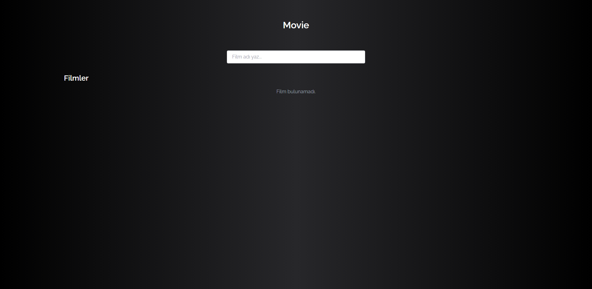
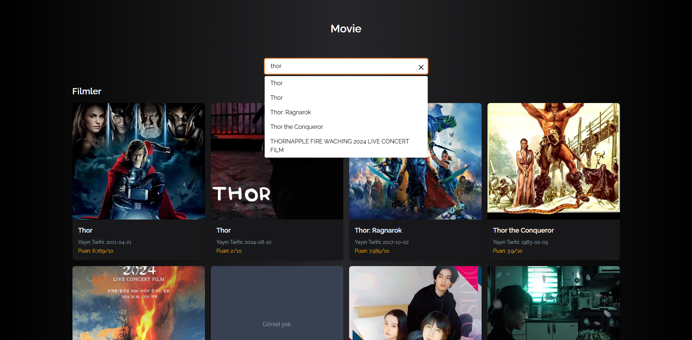

# Movie Search React App 🎬

Bu proje, **React** ve **Tailwind CSS** kullanılarak yapılmış basit bir film arama uygulamasıdır.  
The Movie Database (TMDB) API kullanılarak, kullanıcıların film araması yapmasına ve sonuçları listelemesine olanak sağlar.
Arama inputu dahil hiçbir yerde hazır paket kullanılmamıştır hepsi manual olarak yapılmıştır.

---

## Özellikler

- Canlı arama önerileri (ilk 5 sonuç gösterilir)
- "Tüm sonuçları gör" seçeneği ile daha fazla film görüntüleme
- Film detay kartları (poster, isim, çıkış tarihi, puan)
- Responsive ve şık tasarım (Tailwind CSS)
- Temiz ve anlaşılır React bileşen yapısı

---

## Ekran Görüntüleri

### Arama Sonuçları


### Film Kartları


---

## Kurulum ve Çalıştırma

1. Depoyu klonla:

```bash
git clone https://github.com/kullaniciadi/movie-react.git
cd movie-react
